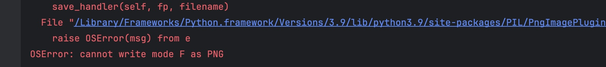

## OSError: cannot write mode F as PNG

imageio.imwrite(save_path, shifted_img)



```python
# Normalize shifted_img to range [0, 255] and convert to uint8
    shifted_img = ((shifted_img - shifted_img.min()) / (shifted_img.max() - shifted_img.min()) * 255).astype(np.uint8)

# If the image is RGB, convert it to grayscale
if len(img.shape) == 3:
    img = np.dot(img[..., :3], [0.299, 0.587, 0.114])
```


