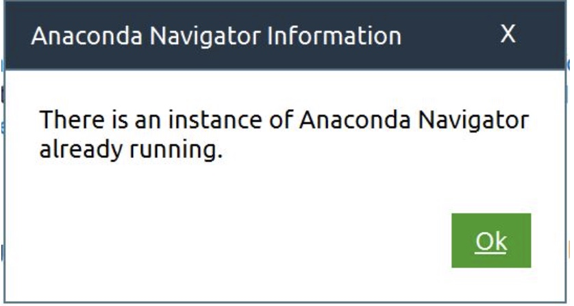
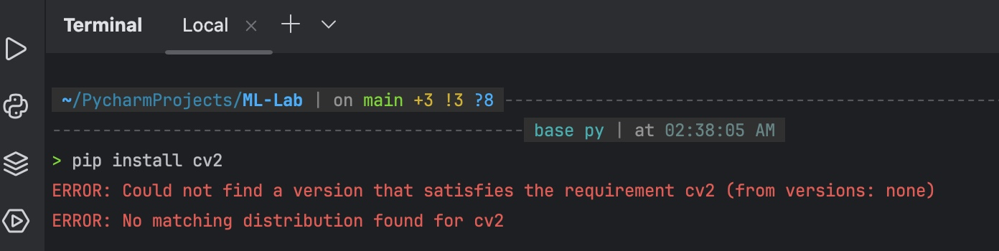
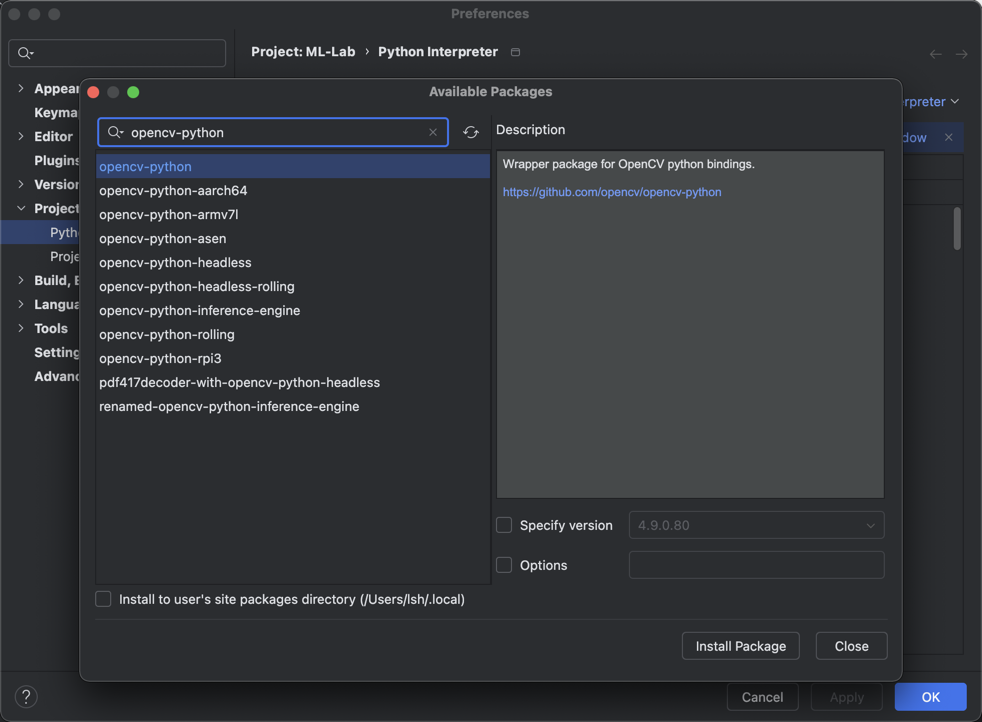

## there is an instance of anaconda navigator already running

Previously my anaconda navigator was not responding so I have rebooted my computer and now when I am trying to open anaconda navigator it pop-ups an error with "there is an instance of anaconda navigator already running".



```zsh
killall python
```

## ERROR: Could not find a version that satisfies the requirement cv2



fix:



